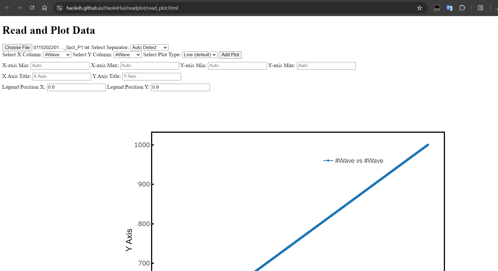
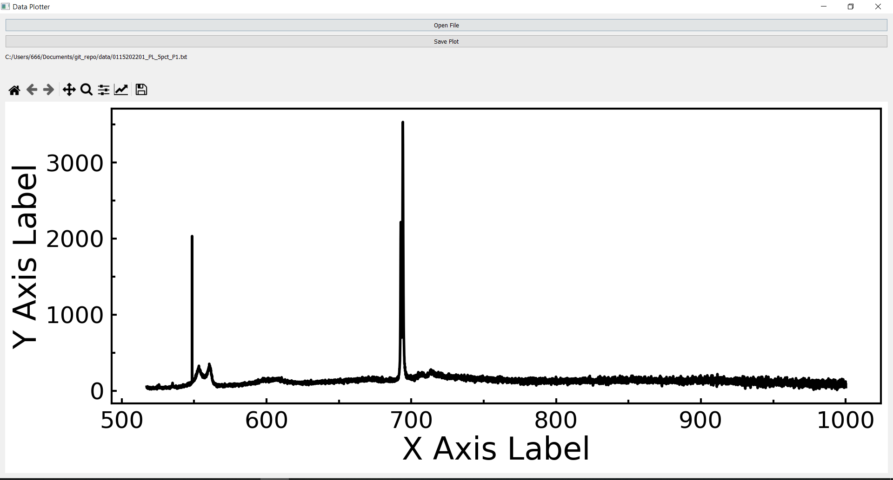

# Read data files and plot them
this project is created with the help of ChatGPT and Gemini.

The motivation  of this project is that I want to find a way to convinently plot the data obtained from different measurements, without putting it in excel or origin. The program should have folowing features:

1. it should be able to read files and provide a decent graph within a few clicks
2. it should be able to auto-detect headers and delimiters in the file
3. graph genrated should be interactive
4. graph can be saved.
5. it should have as few as possible prequistes.
---
## Do it by Python
Initially I was trying to do it with python since I am familiar with it (not with pyQt though). 
[readplot.py](https://github.com/HaoleiH/read_plot/readplot.py) shows a python script to create a Qt window, read a file and plot the file.

The file should only contain 2 columns. The script will use first column as x and second column as y to plot. headers and delimiters can be detected automatically. A [exe](https://github.com/HaoleiH/read_plot/releases/tag/v1.0) version is also available for windows system. python scripts are cross-platform naturally, but you still need to install python environment and packages to use it.

---
## Transfer to HTML
Suddenly, I realized that why don't I do it in browser? Browser is installed in every PC. It has the ability to run a html webpage to meet my requirements. If I host it on Github pages, I will be able to access it from anywhere and use it without installing anything. I don't know javascript coding but why does it matter? I don't know Qt either. ChatGPT will do  most of the jobs anyway.

The process of making the html file to fullfil my goal is much easier than I thought. No need to install different packages and dealing with the package dependencies. Just need to modify it in a text editor and open it in a browser to see how it works. Finally [read_plot.html](https://github.com/HaoleiH/read_plot/read_plot.html) came out. It is also host on [Github pages](https://haoleih.github.io/HaoleiHui/readplot/read_plot.html) and can be used from any device with a browser.

---
## How to use it?
For the usage of the [read_plot](https://haoleih.github.io/HaoleiHui/readplot/read_plot.html) webpage, it stores all the uploaded files locally in your browser. The plotting feature is supported by [plotly.js](https://github.com/plotly/plotly.js),  so you will need internet access to run it. Alternatively, if you want to run it completely locally, you can download the [read_plot.html](https://github.com/HaoleiH/read_plot/read_plot.html), and [plotly.js library](https://cdn.plot.ly/plotly-latest.min.js), save them in the same folder, modify line 8 in read_plot.html from:
```
<script src="https://cdn.plot.ly/plotly-latest.min.js"></script>
```

to

```
<script src="plotly-latest.min.js"></script>
```
Then you should be able to run it locally.

## Some pictures






